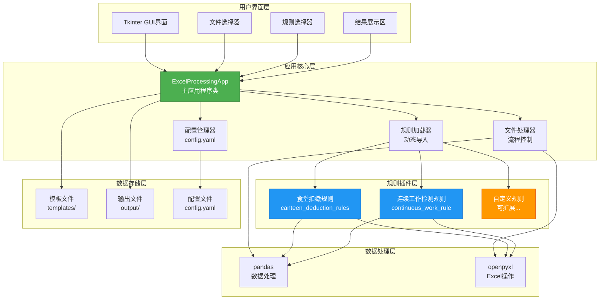
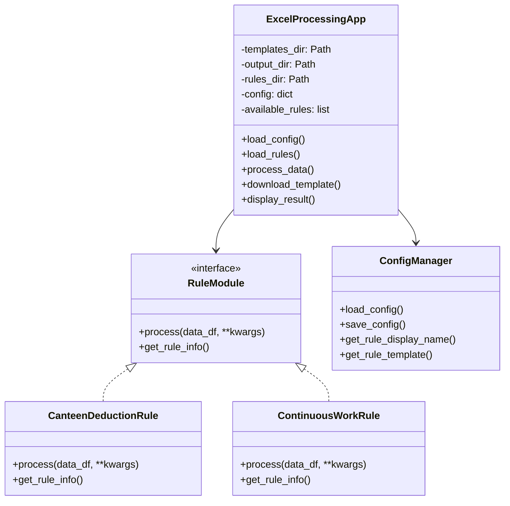
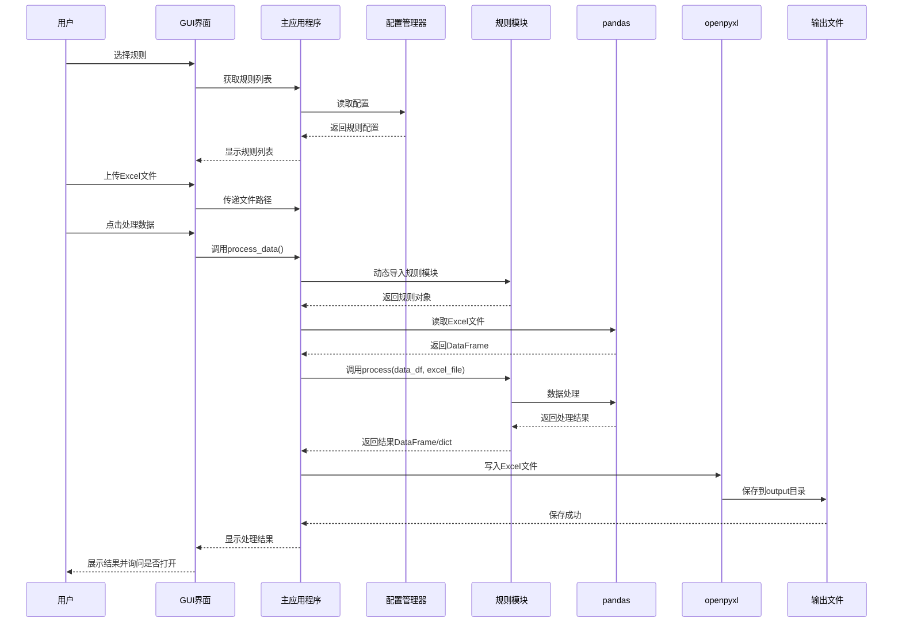
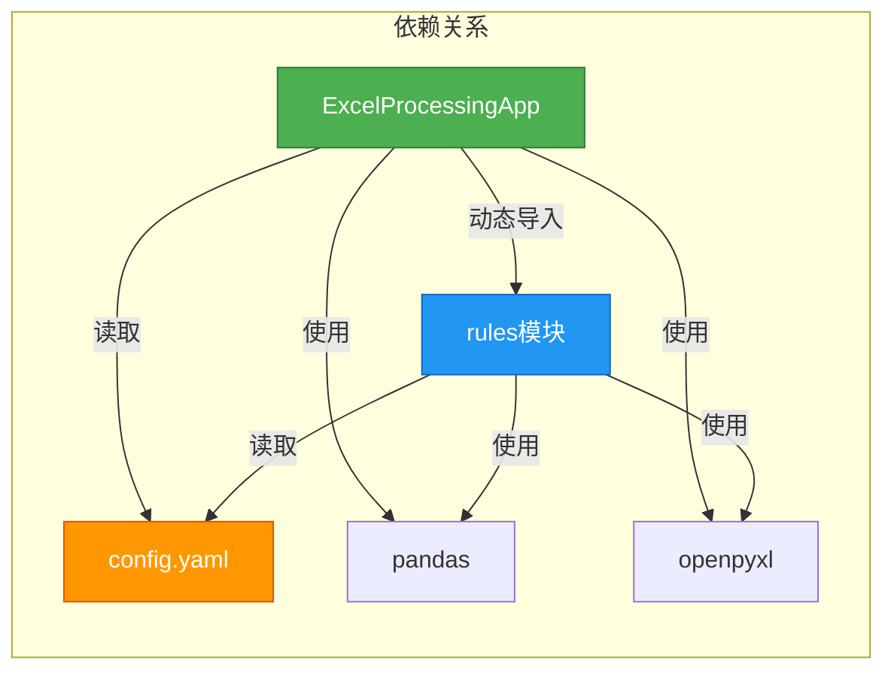

# Excel数据处理工具

[](https://www.python.org/)
[](LICENSE)
[](https://www.microsoft.com/windows)

一个基于Python和Tkinter开发的桌面应用程序，用于处理Excel数据。采用插件式架构设计，支持多种数据处理规则，可灵活扩展自定义处理逻辑。

## 🚀 项目简介

Excel数据处理工具是一个功能强大的桌面应用程序，旨在简化Excel数据的批量处理工作。通过规则化的处理方式，用户可以快速处理各种Excel数据，生成标准化的处理结果。

### 主要特性

- ✅ **插件式架构**：支持自定义处理规则，易于扩展
- ✅ **模板管理**：提供Excel模板下载功能，确保数据格式统一
- ✅ **多规则支持**：内置多种数据处理规则，满足不同业务场景
- ✅ **结果保留**：处理结果保留原始工作表，新增处理结果工作表
- ✅ **图形界面**：友好的GUI界面，操作简单直观
- ✅ **可执行文件**：支持打包成独立的exe文件，无需安装Python环境

### 核心功能

1. **规则选择**：从下拉菜单中选择要应用的处理规则
2. **模板下载**：下载对应规则的Excel模板文件
3. **文件处理**：上传Excel数据文件，自动应用选定规则进行处理
4. **结果生成**：生成处理后的Excel文件，保存在output目录
5. **结果查看**：处理完成后可选择直接打开生成的文件

## 🛠️ 技术栈

### 核心技术

- **Python 3.6+**：主要编程语言
- **Tkinter**：GUI框架（Python标准库）
- **pandas**：数据处理和分析
- **openpyxl**：Excel文件读写操作
- **PyYAML**：配置文件管理
- **PyInstaller**：应用程序打包工具

### 主要依赖包

| 包名 | 版本 | 用途 |
|------|------|------|
| pandas | >=1.3.0 | 数据处理和分析 |
| openpyxl | >=3.0.7 | Excel文件操作 |
| numpy | ==1.24.3 | 数值计算支持 |
| pyyaml | >=6.0 | YAML配置文件解析 |
| pyinstaller | ==5.9.0 | 可执行文件打包 |

## 📁 项目结构

```
120_EXCEL_PROCESSING/
├── main.py                      # 主应用程序入口
├── config.yaml                  # 配置文件（规则和模板映射）
├── requirements.txt             # Python依赖包列表
├── excel_tool.spec              # PyInstaller打包配置文件
├── create_venv.bat              # Windows批处理脚本（创建虚拟环境）
├── setup_env.ps1                # PowerShell脚本（创建虚拟环境）
│
├── rules/                       # 处理规则模块目录
│   ├── __init__.py              # 规则包初始化文件
│   ├── canteen_deduction_rules.py    # 食堂扣缴规则
│   └── continuous_work_rule.py       # 连续工作超时检测规则
│
├── templates/                   # Excel模板文件目录
│   ├── 食堂扣缴.xlsx            # 食堂扣缴规则模板
│   └── 工作超6天查找.xlsx       # 连续工作检测规则模板
│
├── output/                      # 处理结果输出目录
│   └── *_processed.xlsx         # 处理后的Excel文件
│
├── assets/                      # 资源文件目录
│   └── icon.ico                 # 应用程序图标
│
├── build/                       # PyInstaller构建临时文件
├── dist/                        # 打包后的可执行文件目录
│   └── Excel数据处理工具.exe    # 打包后的可执行文件
│
└── venv/                        # Python虚拟环境（不纳入版本控制）
```

### 目录说明

- **main.py**：主程序文件，包含GUI界面和核心业务逻辑
- **rules/**：处理规则模块目录，每个规则是一个独立的Python模块
- **templates/**：Excel模板文件目录，存放各规则对应的模板文件
- **output/**：处理结果输出目录，所有处理后的文件保存在此
- **config.yaml**：配置文件，定义规则的显示名称和模板映射关系

## 🏗️ 架构设计

### 架构模式

项目采用**插件式架构（Plugin Architecture）**设计，核心特点：

1. **规则模块化**：每个处理规则是独立的Python模块
2. **动态加载**：运行时动态扫描和加载规则模块
3. **配置驱动**：通过YAML配置文件管理规则和模板映射
4. **接口统一**：所有规则遵循统一的接口规范
5. **松耦合**：规则模块与主程序解耦，易于扩展和维护

### 系统架构图



### 核心模块划分



### 数据流设计



### 关键组件依赖关系



### 架构特点说明

1. **分层设计**：
   - **用户界面层**：负责用户交互和界面展示
   - **应用核心层**：负责业务逻辑和流程控制
   - **规则插件层**：负责具体的数据处理逻辑
   - **数据处理层**：提供底层数据处理能力
   - **数据存储层**：管理文件和配置数据

2. **插件机制**：
   - 规则模块通过统一接口（`process()`和`get_rule_info()`）与主程序交互
   - 主程序通过`importlib`动态加载规则模块
   - 配置文件管理规则与模板的映射关系

3. **数据流向**：
   - 输入：用户通过GUI选择文件和规则
   - 处理：主程序调用规则模块处理数据
   - 输出：处理结果保存到output目录

## 🚀 快速开始

### 环境要求

- **Python版本**：Python 3.6 或更高版本
- **操作系统**：Windows 10/11（主要支持平台）
- **内存**：建议至少 512MB 可用内存
- **磁盘空间**：至少 100MB 可用空间

### 安装步骤

#### 方法一：使用虚拟环境（推荐）

**Windows (批处理脚本)：**

```bash
# 1. 创建虚拟环境并安装依赖
create_venv.bat

# 2. 激活虚拟环境（如果未自动激活）
venv\Scripts\activate.bat

# 3. 安装依赖包
pip install -r requirements.txt -i https://mirrors.aliyun.com/pypi/simple/
```

**Windows (PowerShell)：**

```powershell
# 1. 创建虚拟环境并安装依赖
.\setup_env.ps1

# 2. 激活虚拟环境（如果未自动激活）
.\venv\Scripts\Activate.ps1

# 3. 安装依赖包
pip install -r requirements.txt -i https://mirrors.aliyun.com/pypi/simple/
```

#### 方法二：手动安装

```bash
# 1. 创建虚拟环境
python -m venv venv

# 2. 激活虚拟环境
# Windows
venv\Scripts\activate
# Linux/Mac
source venv/bin/activate

# 3. 安装依赖包
pip install -r requirements.txt -i https://mirrors.aliyun.com/pypi/simple/
```

### 运行应用程序

```bash
# 确保虚拟环境已激活
python main.py
```

### 打包为可执行文件

```bash
# 使用PyInstaller打包
pyinstaller excel_tool.spec

# 打包后的可执行文件位于 dist/ 目录
# 文件名为：Excel数据处理工具.exe
```

## 🔧 配置说明

### 配置文件结构

`config.yaml` 文件定义了规则和模板的映射关系：

```yaml
default_rule: continuous_work_rule  # 默认规则ID

rules:
  continuous_work_rule:              # 规则ID
    display_name: 连续工作超时检测    # 规则显示名称
    template: 工作超6天查找.xlsx      # 对应的模板文件名
  
  canteen_deduction_rules:           # 规则ID
    display_name: 食堂扣缴规则        # 规则显示名称
    template: 食堂扣缴.xlsx          # 对应的模板文件名
```

### 配置项说明

- **default_rule**：默认选中的规则ID
- **rules**：规则配置字典
  - **规则ID**：对应 `rules/` 目录下的Python文件名（不含.py扩展名）
  - **display_name**：在GUI界面中显示的规则名称
  - **template**：对应的Excel模板文件名（位于 `templates/` 目录）

### 添加新规则配置

1. 在 `rules/` 目录下创建新的规则模块文件（如 `my_rule.py`）
2. 在 `config.yaml` 中添加规则配置：

```yaml
rules:
  my_rule:
    display_name: 我的自定义规则
    template: my_rule_template.xlsx
```

3. 在 `templates/` 目录下放置对应的模板文件
4. 重启应用程序，新规则将自动加载

## 📚 使用指南

### 基础使用流程

1. **启动应用程序**
   ```bash
   python main.py
   ```

2. **选择处理规则**
   - 从"选择处理规则"下拉框中选择要应用的规则

3. **下载模板**（可选）
   - 点击"下载模板"按钮
   - 选择保存位置，获取对应的Excel模板文件

4. **填写数据**
   - 使用下载的模板或现有Excel文件
   - 按照模板格式填写数据

5. **上传文件**
   - 点击"浏览"按钮
   - 选择要处理的Excel文件

6. **处理数据**
   - 点击"处理数据"按钮
   - 等待处理完成

7. **查看结果**
   - 处理完成后，结果文件保存在 `output/` 目录
   - 文件名格式：`原文件名_processed.xlsx`
   - 可选择直接打开生成的文件

### 内置规则说明

> 📖 **详细文档**：所有规则的完整说明文档请查看 [rules/README.md](rules/README.md)

#### 1. 食堂扣缴规则 (canteen_deduction_rules)

**功能**：处理员工食堂消费记录，计算扣缴金额

**详细文档**：[canteen_deduction_rules.md](rules/canteen_deduction_rules.md)

**输入要求**：
- Excel文件必须包含两个工作表：
  - **消费记录**：包含工号、姓名、交易金额、交易日期、餐别等列
  - **打卡记录**：包含姓名、工号、日期、实际出勤工时等列

**输出结果**：
- **扣缴记录**工作表：包含每日的扣缴明细
- **月度汇总**工作表：按工号和月份汇总的扣缴数据

**处理逻辑**：
- 根据实际出勤工时计算享受就餐减免次数（<4小时：0次，4-8小时：1次，≥8小时：2次）
- 统计实际就餐次数和金额
- 计算应扣就餐减免次数和应扣金额

**计算逻辑详解**：详见 [规则说明文档](rules/canteen_deduction_rules.md#计算逻辑详解)

#### 2. 连续工作超时检测规则 (continuous_work_rule)

**功能**：检测连续工作超过6天的记录并标记

**详细文档**：[continuous_work_rule.md](rules/continuous_work_rule.md)

**输入要求**：
- Excel文件格式需符合模板要求
- 从第3行开始为数据行
- 第1列为姓名，第2列开始为日期列

**输出结果**：
- 连续工作超过6天的单元格标记为红色
- 保留原始数据格式

**处理逻辑**：
- 逐行检测连续工作天数
- 标记连续工作超过6天的日期范围

**计算逻辑详解**：详见 [规则说明文档](rules/continuous_work_rule.md#计算逻辑详解)

### 常见问题

**Q: 处理后的文件保存在哪里？**  
A: 所有处理后的文件保存在项目根目录下的 `output/` 目录中。

**Q: 如何添加新的处理规则？**  
A: 参考"自定义处理规则"章节，创建新的规则模块并配置。

**Q: 支持哪些Excel格式？**  
A: 目前支持 `.xlsx` 格式的Excel文件。

**Q: 处理大文件时程序无响应？**  
A: 处理大文件时可能需要较长时间，请耐心等待。建议文件大小不超过50MB。

**Q: 规则加载失败？**  
A: 检查`rules/`目录下是否存在对应的规则文件，以及`config.yaml`中的配置是否正确。

**Q: 模板文件找不到？**  
A: 确保`templates/`目录下存在对应的模板文件，文件名需与`config.yaml`中的配置一致。

**Q: 处理结果不正确？**  
A: 检查输入文件格式是否符合规则要求，参考对应规则的说明文档。

## 🔧 故障排除

### 常见问题及解决方案

#### 1. 程序无法启动

**问题**：双击exe文件或运行`python main.py`后程序无法启动

**可能原因及解决方案**：

- **缺少依赖包**
  - 解决方案：确保已安装所有依赖包
  ```bash
  pip install -r requirements.txt
  ```

- **Python版本不兼容**
  - 解决方案：确保使用Python 3.6或更高版本
  ```bash
  python --version
  ```

- **配置文件损坏**
  - 解决方案：检查`config.yaml`文件格式是否正确，可参考默认配置重新创建

#### 2. 规则无法加载

**问题**：规则下拉框中没有规则或规则加载失败

**可能原因及解决方案**：

- **规则文件不存在**
  - 解决方案：检查`rules/`目录下是否存在规则文件（`.py`文件）
  - 确保文件名与`config.yaml`中的规则ID一致

- **规则文件语法错误**
  - 解决方案：检查规则文件是否有语法错误
  ```bash
  python -m py_compile rules/your_rule.py
  ```

- **缺少必需函数**
  - 解决方案：确保规则文件实现了`process()`和`get_rule_info()`函数

#### 3. 文件处理失败

**问题**：点击"处理数据"后出现错误或处理失败

**可能原因及解决方案**：

- **Excel文件格式错误**
  - 解决方案：确保文件是`.xlsx`格式，不是`.xls`格式
  - 检查文件是否损坏，尝试用Excel打开验证

- **缺少必需的工作表或列**
  - 解决方案：参考规则说明文档，确保输入文件包含所有必需的列和工作表
  - 使用规则对应的模板文件确保格式正确

- **文件被其他程序占用**
  - 解决方案：关闭可能打开该文件的程序（如Excel），确保文件未被锁定

- **内存不足**
  - 解决方案：处理大文件时关闭其他程序，释放内存
  - 考虑分批处理或使用更小的文件

#### 4. 模板下载失败

**问题**：点击"下载模板"按钮后无法下载或文件损坏

**可能原因及解决方案**：

- **模板文件不存在**
  - 解决方案：检查`templates/`目录下是否存在对应的模板文件
  - 确保文件名与`config.yaml`中的配置一致

- **保存路径无权限**
  - 解决方案：选择有写入权限的目录保存模板文件
  - 避免保存到系统保护目录

#### 5. 输出文件无法打开

**问题**：处理完成后生成的Excel文件无法打开或内容错误

**可能原因及解决方案**：

- **文件损坏**
  - 解决方案：重新处理文件，确保处理过程中没有中断
  - 检查磁盘空间是否充足

- **文件被占用**
  - 解决方案：关闭可能打开该文件的程序
  - 如果文件正在被Excel打开，先关闭Excel再处理

- **格式不兼容**
  - 解决方案：确保使用支持`.xlsx`格式的Excel版本（Excel 2007或更高版本）

#### 6. 打包后的exe文件无法运行

**问题**：使用PyInstaller打包后的exe文件无法正常运行

**可能原因及解决方案**：

- **缺少必需文件**
  - 解决方案：确保`templates/`、`rules/`目录和`config.yaml`文件与exe文件在同一目录
  - 检查打包配置（`excel_tool.spec`）是否正确包含所有文件

- **杀毒软件拦截**
  - 解决方案：将exe文件添加到杀毒软件白名单
  - 某些杀毒软件可能误报PyInstaller打包的程序

- **系统兼容性问题**
  - 解决方案：确保目标系统是Windows 10/11（64位）
  - 检查是否有必要的系统运行库（如Visual C++ Redistributable）

### 错误日志查看

如果程序出现错误，可以通过以下方式查看错误信息：

1. **开发模式**：直接运行`python main.py`，错误信息会显示在控制台
2. **打包模式**：如果exe文件设置了`console=True`，错误信息会显示在控制台窗口
3. **日志文件**：某些错误可能会记录在应用程序目录下的日志文件中

### 获取帮助

如果以上解决方案无法解决问题，可以：

1. 查看对应规则的详细说明文档：`rules/README.md`
2. 检查项目Issues：查看是否有类似问题
3. 提交新Issue：提供详细的错误信息和复现步骤

### 调试技巧

**开发环境调试**：

```python
# 在main.py中添加调试信息
import traceback

try:
    # 处理逻辑
    pass
except Exception as e:
    print(f"错误: {str(e)}")
    traceback.print_exc()
```

**检查配置**：

```python
# 验证配置文件
import yaml
with open('config.yaml', 'r', encoding='utf-8') as f:
    config = yaml.safe_load(f)
    print(config)
```

**验证规则模块**：

```python
# 测试规则模块导入
import importlib
rule_module = importlib.import_module('rules.canteen_deduction_rules')
print(rule_module.get_rule_info())
```

## 🧩 自定义处理规则

> 📖 **规则文档**：查看现有规则的详细说明和开发示例，请参考 [rules/README.md](rules/README.md)

### 规则开发规范

每个规则模块必须实现以下两个函数：

#### 1. `process(data_df, **kwargs)` 函数

**功能**：处理数据的主函数

**参数**：
- `data_df` (pandas.DataFrame)：输入的Excel数据（可能为空，取决于规则实现）
- `**kwargs`：其他参数，通常包含 `excel_file`（Excel文件路径）

**返回值**：
- `pandas.DataFrame`：处理后的数据（单表结果）
- `dict`：包含多个DataFrame的字典（多表结果）
  - 字典的key将作为工作表名称
  - 字典的value是DataFrame对象

**示例**：

```python
def process(data_df, **kwargs):
    """
    处理Excel数据的函数
    
    参数:
        data_df (pandas.DataFrame): 输入的Excel数据
        kwargs: 其他参数，包括excel_file（Excel文件路径）
        
    返回:
        pandas.DataFrame 或 dict: 处理后的数据
    """
    excel_file = kwargs.get('excel_file')
    
    # 读取Excel文件
    df = pd.read_excel(excel_file)
    
    # 处理逻辑
    result_df = df.copy()
    result_df['处理状态'] = '已处理'
    
    # 返回结果
    return result_df
```

#### 2. `get_rule_info()` 函数

**功能**：返回规则的描述信息

**返回值**：
- `dict`：包含规则信息的字典

**示例**：

```python
def get_rule_info():
    """返回规则的描述信息"""
    return {
        "name": "我的规则",
        "description": "规则功能描述",
        "version": "1.0",
        "author": "作者名称"
    }
```

### 规则开发步骤

1. **创建规则文件**
   ```bash
   # 在 rules/ 目录下创建新文件
   rules/my_rule.py
   ```

2. **实现规则逻辑**
   ```python
   import pandas as pd
   
   def process(data_df, **kwargs):
       # 实现处理逻辑
       return result_df
   
   def get_rule_info():
       return {
           "name": "我的规则",
           "description": "规则描述",
           "version": "1.0",
           "author": "作者"
       }
   ```

3. **创建模板文件**
   ```bash
   # 在 templates/ 目录下创建模板
   templates/my_rule_template.xlsx
   ```

4. **配置规则**
   ```yaml
   # 在 config.yaml 中添加配置
   rules:
     my_rule:
       display_name: 我的自定义规则
       template: my_rule_template.xlsx
   ```

5. **测试规则**
   - 重启应用程序
   - 选择新规则进行测试

### 规则示例

完整规则示例请参考：
- `rules/canteen_deduction_rules.py` - [食堂扣缴规则说明](rules/canteen_deduction_rules.md)
- `rules/continuous_work_rule.py` - [连续工作超时检测规则说明](rules/continuous_work_rule.md)

更多规则文档请查看 [rules/README.md](rules/README.md)

## 🧪 测试

### 运行测试

目前项目暂未包含自动化测试套件，建议通过以下方式进行测试：

1. **功能测试**：使用实际Excel文件测试各规则功能
2. **边界测试**：测试空文件、大文件、格式错误文件等边界情况
3. **集成测试**：测试完整的处理流程

### 测试建议

- 使用小样本数据先进行测试
- 验证处理结果的准确性
- 检查输出文件的格式和内容
- 测试不同规则之间的切换

### 测试策略说明

- **单元测试**：建议为每个规则模块编写单元测试
- **集成测试**：测试主程序与规则模块的集成
- **用户验收测试**：使用真实业务数据进行测试
- **性能测试**：测试大文件处理性能

### 测试覆盖率

当前项目暂未实现自动化测试，测试覆盖率为0%。建议后续添加：
- pytest测试框架
- 单元测试覆盖率目标：>80%
- 集成测试覆盖主要功能流程

## 📦 打包部署

### 使用PyInstaller打包

项目已配置 `excel_tool.spec` 文件，可直接使用：

```bash
# 打包命令
pyinstaller excel_tool.spec

# 打包后的文件位于 dist/ 目录
# 可执行文件：Excel数据处理工具.exe
```

### 打包配置说明

`excel_tool.spec` 文件配置了以下内容：

- **包含的文件**：
  - `templates/` 目录（模板文件）
  - `rules/` 目录（规则模块）
  - `config.yaml`（配置文件）

- **隐藏导入**：
  - pandas, numpy, openpyxl, yaml

- **图标**：`assets/icon.ico`

- **控制台**：设置为False（隐藏控制台窗口）

### 分发说明

打包后的可执行文件包含所有依赖，可在没有Python环境的Windows系统上直接运行。

**分发包结构**：

```
Excel数据处理工具/
├── Excel数据处理工具.exe    # 主程序可执行文件
├── templates/                # 模板文件目录
│   ├── 食堂扣缴.xlsx
│   └── 工作超6天查找.xlsx
├── rules/                    # 规则模块目录
│   ├── __init__.py
│   ├── canteen_deduction_rules.py
│   └── continuous_work_rule.py
└── config.yaml               # 配置文件
```

**分发步骤**：

1. 使用PyInstaller打包生成exe文件
2. 将`templates/`、`rules/`目录和`config.yaml`复制到exe文件同目录
3. 确保目录结构完整
4. 测试可执行文件是否正常运行

### 部署环境要求

**目标系统**：
- Windows 10/11（64位）
- 无需安装Python环境
- 无需安装额外依赖

**系统要求**：
- 内存：至少512MB可用内存
- 磁盘空间：至少200MB可用空间
- 处理器：支持64位指令集

### 性能指标

**处理性能**（基于测试数据）：

| 文件大小 | 记录数 | 处理时间 | 内存占用 |
|---------|--------|---------|---------|
| < 1MB   | < 1000行 | < 2秒 | < 100MB |
| 1-5MB   | 1000-5000行 | 2-10秒 | 100-200MB |
| 5-10MB  | 5000-10000行 | 10-30秒 | 200-400MB |
| > 10MB  | > 10000行 | > 30秒 | > 400MB |

**性能优化建议**：
- 对于大文件（>10MB），建议分批处理
- 处理前关闭其他占用内存的程序
- 确保有足够的磁盘空间用于临时文件

## 🤝 贡献指南

### 开发流程

1. Fork 本仓库
2. 创建特性分支 (`git checkout -b feature/AmazingFeature`)
3. 提交更改 (`git commit -m 'Add some AmazingFeature'`)
4. 推送到分支 (`git push origin feature/AmazingFeature`)
5. 开启 Pull Request

### 代码规范

- 遵循 PEP 8 Python编码规范
- 使用有意义的变量和函数名
- 添加必要的注释和文档字符串
- 保持函数单一职责原则

### 提交规范

提交信息应清晰描述本次更改：

```
feat: 添加新功能
fix: 修复bug
docs: 更新文档
style: 代码格式调整
refactor: 代码重构
test: 添加测试
chore: 构建过程或辅助工具的变动
```

## 📄 许可证

本项目采用 MIT 许可证。详情请参阅 [LICENSE](LICENSE) 文件。

## 🔗 相关资源

- [pandas文档](https://pandas.pydata.org/docs/)
- [openpyxl文档](https://openpyxl.readthedocs.io/)
- [PyInstaller文档](https://pyinstaller.readthedocs.io/)
- [Tkinter文档](https://docs.python.org/3/library/tkinter.html)

## 📝 更新日志

### v1.0.0 (当前版本)

- ✅ 实现基础Excel数据处理功能
- ✅ 支持插件式规则架构
- ✅ 实现食堂扣缴规则
- ✅ 实现连续工作超时检测规则
- ✅ 支持模板下载功能
- ✅ 支持打包为可执行文件
- ✅ 图形化用户界面

## 👥 作者

- **系统** - 初始开发

## 🙏 致谢

感谢所有为本项目做出贡献的开发者！

---

**注意**：本项目仍在持续开发中，如有问题或建议，欢迎提交Issue或Pull Request。
